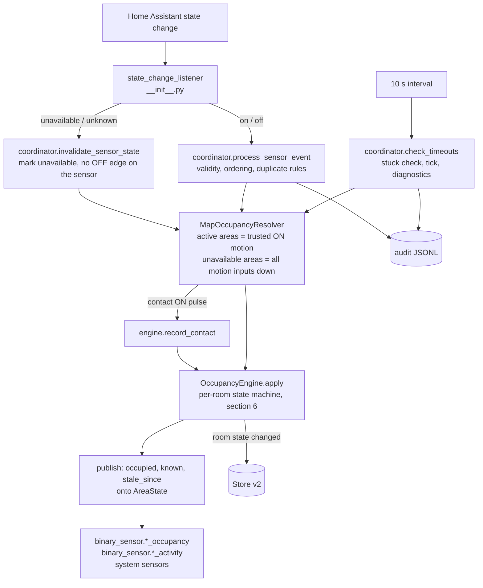
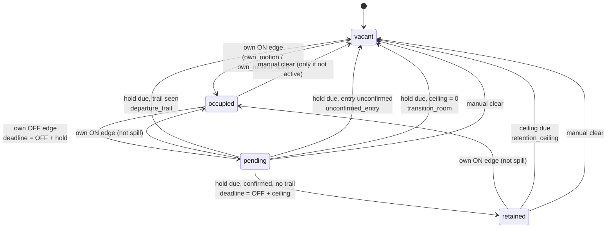
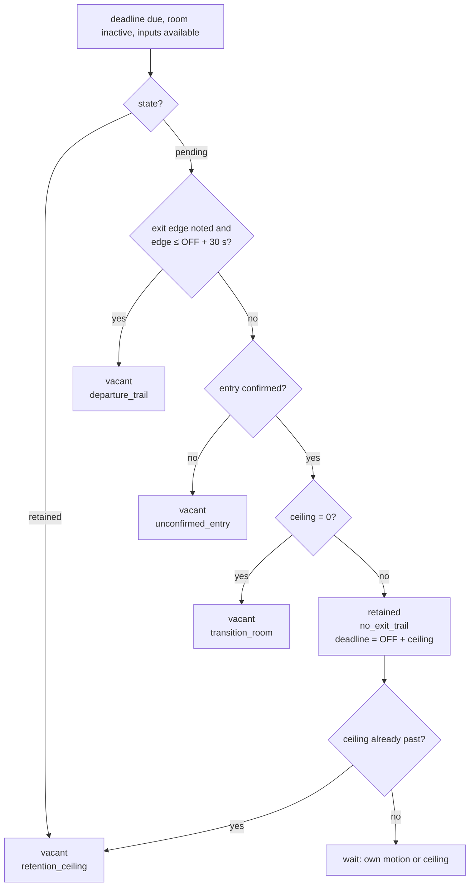

# Occupancy tracker: behavior specification

Status: normative. The code must behave as written here. When behavior needs
to change, change this document first, then the tests, then the code, then
re-run the replay. Where the code is known to differ today, section 15 says so.
This document supersedes the behavior claims in `ARCHITECTURE.md` and
`README.md`. Design evidence lives in the parent workspace under `output/`
(`occupancy-handoff-2026-09-06.md`, `occupancy-implementation-handoff-2026-09-06.md`,
`occupancy-replay-2026-09-06.md`, `occupancy-data-analysis/report.md`).

## 1. What the integration answers

For each configured area the integration publishes two binary sensors.

- `binary_sensor.<slugified area name>_occupancy` answers **is someone in this
  room?** It is the decision output, held past sensor silence when the person
  plausibly has not left, and released when they plausibly have, or when a
  policy ceiling bounds the doubt.
- `binary_sensor.<slugified area name>_activity` answers **was there motion or
  a door event here recently?** It is a convenience signal with a short hold.
  It is never an input to the occupancy decision.

The object id comes from the area's `name:`, slugified by Home Assistant, and
falls back to the area id when `name:` is absent. For most areas the two are
the same string. Six areas of the current house differ: `guest_room` publishes
as `guest_toilet`, `corridor_1` as `corridor_1_front`, `corridor_2` as
`corridor_2_back`, `living` as `living_room`, `frontyard` as `front_yard`, and
`backyard` as `back_yard`.

The hardware is passive infrared (PIR) motion detectors and envelope door and
window contacts. PIR cannot see a motionless person, and a contact does not say
who passed or in which direction. The occupancy output is therefore an
estimate with documented error cases (section 12), not physical truth.

Two consumers read the occupancy entity and want opposite errors:

- `motion_lights_automation` uses it as a motion input; a false vacant leaves a
  person in the dark, a false occupied only costs electricity.
- `hvac_supervisor` reads it to decide whether a room is empty; a false vacant
  can let it act on an empty-room policy, a false occupied blocks that policy.

The integration does not pick a side by consumer. It publishes one honest
estimate with the evidence behind it, and each consumer applies its own policy.

## 2. Vocabulary

| Term | Meaning |
| --- | --- |
| Area, room | A configured space. `indoors: true` (default) makes it a room with the full state machine; `indoors: false` makes it an outdoor area that mirrors its sensors. |
| Own motion | A trusted motion-class sensor mapped to the room reading ON. |
| Edge | A change of a room's own motion from OFF to ON (ON edge) or ON to OFF (OFF edge). |
| Exit | An indoor neighbor through which a person can leave the room. Derived from adjacency (section 4). |
| Dead end | An indoor neighbor whose only indoor connection is this room (an ensuite, a walk-in wardrobe). Entering it is not leaving, so it is not an exit. |
| Departure trail | An ON edge on one of the room's exits, or a pulse on one of the room's own contacts, timed so it could be the occupant leaving (section 6.4). |
| Spill | A detector seeing motion in an adjacent space through a doorway. An own ON edge that starts within 2 s of an exit neighbor's ON edge, while that neighbor is still ON, is treated as spill. |
| Hold | The wait after the room's own motion stops before the room decides. |
| Retention | Keeping a room occupied after the hold when no departure trail was seen. |
| Ceiling | The maximum retention time. It bounds a missed exit; it does not prove occupancy. |
| Confirmed | The room's current occupancy episode began with an own ON edge that was not spill. |
| Unknown | The room's motion inputs are all unavailable past a grace period. Published as `unavailable`, never as `off`. |

## 3. Inputs

### 3.1 Sensor classes

| `type` | Class | Role |
| --- | --- | --- |
| `motion`, `camera_motion`, `camera_person` | motion | Occupancy evidence for every area the sensor maps to. |
| `magnetic`, `door`, `window`, `garage_door` | contact | Departure evidence for the indoor room the sensor maps to. Never occupancy evidence. |

A sensor may map to several areas (`area: [a, b]`). A motion ON counts for all
of them. A contact pulse counts as own-exit evidence for each mapped indoor
room.

### 3.2 Trust

A sensor reading is **trusted active** when all three hold: its current state
is ON, it is available, and it is reliable.

- **Available.** A Home Assistant state of `unavailable` or `unknown`, or a
  missing entity at startup, marks the sensor unavailable without inventing an
  OFF edge on the sensor: `mark_unavailable` records the loss of transport and
  leaves the sensor's last physical state alone. The room is a separate
  question. Losing the sensor drops the area out of the active set, so a room
  that was `occupied` enters `pending` with reason `hold` and `last_own_off`
  set to that instant. A sensor that returns still ON is a resumption
  (section 6.1): the room reads `occupied` again with reason
  `own_motion_resumed` and the hold is canceled. The published binary value
  therefore never changes across a blip inside the grace period, while
  `state`, `reason`, `state_since` and `deadline` do. Any later `on` or `off`
  state restores availability.
- **Reliable.** A motion sensor that has read ON continuously for more than
  24 h is stuck and becomes unreliable. It drops out of trusted-active, which
  the engine sees as an OFF edge for the room. Its next real state change
  restores reliability. This is the only diagnostic that changes an input.

An area is **active** when at least one trusted-active motion sensor maps to
it. An area is **unavailable** when every motion sensor mapped to it is
unavailable; one working input keeps the room known. An indoor area with no
motion sensors is never active and never unknown.

### 3.3 Timestamps and ordering

Every event carries a source time (the entity's `last_updated`) and a receipt
time (local clock). Decisions use the source time. Rules:

- A source time that is not finite, is negative, or is more than 60 s after the
  receipt time is ignored (`ignored_invalid_timestamp`).
- A source time older than the sensor's latest accepted source time is ignored
  (`ignored_out_of_order`). A late event never rewinds state.
- A repeated ON from a trusted-active motion sensor is a keep-alive
  (`accepted_keepalive`): it refreshes the area's last-motion time for the
  activity signal and diagnostics, and it is not an edge. Any other repeat is
  ignored (`ignored_duplicate`); if it restores availability, that is recorded.
- Inside the engine time is monotonic: an event stamped earlier than the last
  processed one is clamped forward. Restore resets this clamp to zero so that
  startup baselines, which carry the sensors' real older `last_changed` times,
  are processed at their own times (otherwise every startup entry would look
  like spill).

Stuck detection uses the receipt time, because a source time may be an old
Home Assistant startup state.

### 3.4 Pipeline



Only the engine changes a room's state. Everything upstream decides what
evidence the engine sees; everything downstream reports the engine's answer.

## 4. Topology

Adjacency in `config.yaml` is one-sided and is made symmetric. Only indoor
neighbors matter for exits.

**Exit rule.** `exits(room)` is the set of indoor neighbors N of `room` such
that N has at least one indoor neighbor other than `room`. A neighbor that
fails that test is a dead end and is excluded. Outdoor areas are never exits:
outdoor activity never manufactures an indoor departure.

`exit_capable` and `open_plan_groups` never affect an occupancy decision.
`exit_capable` has three diagnostic effects, and only the first is limited to
outdoor areas: it selects which outdoor areas can raise the `exit_area_stale`
warning; it suppresses `phantom_occupancy_suspected` for the area; and it makes
every activation of the area plausible, so `unexpected_motion` never fires
there. `between_areas` on contacts is validated and unused.

Derived exits for the current house (`config.yaml`). The `main_bedroom`,
`bedroom_1` and `study` rows are pinned by
`tests/integration/test_production_replay.py` and
`tests/occupancy_tracker/test_ambiguity_worlds.py`; the full table is pinned by
`tests/occupancy_tracker/test_behavior_spec.py`:

| Room | Exits | Dead ends excluded |
| --- | --- | --- |
| entrance | garage, corridor_1, kitchen, workshop | guest_room |
| garage | entrance, workshop | |
| guest_room | entrance | |
| workshop | entrance, garage | |
| corridor_1 | entrance, corridor_2, bedroom_2 | study, bathroom |
| corridor_2 | corridor_1, bedroom_2, main_bedroom | bedroom_1, utility_room |
| kitchen | entrance, dining_room, living | |
| dining_room | kitchen, living | |
| living | kitchen, dining_room | |
| study | corridor_1 | |
| bedroom_2 | corridor_1, corridor_2 | |
| bathroom | corridor_1 | |
| bedroom_1 | corridor_2 | (left_side is outdoor) |
| utility_room | corridor_2 | (left_side is outdoor) |
| main_bedroom | corridor_2 | main_bathroom, wardrobe |
| main_bathroom | main_bedroom | |
| wardrobe | main_bedroom | |

Two consequences are accepted: corridors lose their dead-end rooms as exits,
which is harmless because corridors never retain; and a visit to the guest
toilet leaves the entrance without a trail, so the entrance can retain until
its ceiling or until someone walks back through it.

## 5. Profiles and timing constants

A room's profile comes from `profile:`; `transition: true` selects
`transition` when `profile:` is absent; otherwise `default`.

| Profile | Hold | Retention ceiling | Activity hold | Rooms today |
| --- | ---: | ---: | ---: | --- |
| `transition` | 30 s | 0 (never retains) | 20 s | corridor_1, corridor_2 |
| `default` | 90 s | 2 h | 2 min | entrance, garage, guest_room, workshop, bedroom_2, bathroom, utility_room, main_bathroom, wardrobe |
| `living` | 90 s | 4 h | 2 min | kitchen, dining_room, living, study |
| `sleeping` | 90 s | 12 h | 15 min | bedroom_1, main_bedroom |

Household decision recorded 2026-09-09: **bathroom and utility_room should
keep reading occupied while in doubt, but 15 minutes with no motion means
vacant.** That is a new `transient` profile (hold 90 s, ceiling 15 min) for
those two rooms. The global `default` stays at 2 h because bedroom_2 is the
nursery and relies on it (section 13). Not yet implemented; see section 15.

| Constant | Value | Meaning |
| --- | ---: | --- |
| Spill window | 2 s | Own ON edge within this of an exit neighbor's ON edge, neighbor still ON, is spill. |
| Trail window | 30 s | An exit edge counts as a trail if it lands no later than this after the room's own OFF edge. |
| Unavailable grace | 60 s | A room with all motion inputs unavailable publishes unknown after this. |
| Tick | 10 s | Deadlines are evaluated at least this often; a deadline fires within 10 s of coming due. |
| Publish interval | 60 s | A quiet tick republishes entities at most this often; a change publishes at once. |
| Stuck threshold | 24 h | Continuous ON after which a motion sensor is unreliable. |
| Source clock skew | 60 s | Maximum future offset of a source time. |
| Storage version | 2 | Persisted decision state format. |

## 6. The per-room state machine

Each indoor room is in exactly one of `vacant`, `occupied`, `pending`,
`retained`. The published binary sensor is ON in `occupied`, `pending` and
`retained`. An `unknown` overlay (section 8) can hide any of them.



### 6.1 Own ON edge

When a room's own motion goes from inactive to active:

1. If the sensor is coming back from unavailable and was ON when it left
   (section 8), this is a **resumption**, not an edge: the room becomes
   `occupied` with reason `own_motion_resumed`, keeps its activation time and
   any trail already noted, and clears its deadline. No exit edges are noted
   for neighbors.
2. Otherwise decide **spill**: the edge is spill if some exit neighbor was
   active before this event and this edge starts between 0 and 2 s after that
   neighbor's own ON edge.
3. If the edge is spill and the room is `pending` or `retained`, ignore it. It
   says nothing about whoever is inside, it must not confirm the entry and must
   not erase a trail already seen. Its following OFF edge is ignored too. The
   room keeps heading for the decision it already had.
4. Otherwise the room becomes `occupied`. A non-spill edge sets
   `confirmed = true` (reason `own_motion`). A spill edge into a `vacant` room
   sets `confirmed = false` (reason `own_motion_spill`). The activation time is
   recorded, the noted trail is cleared, and the deadline is cleared.

Design note, deliberately looser than the original rule text: a later own edge
confirms a spilled entry once it is more than 2 s past the neighbor's ON edge,
even if the neighbor is still ON. The detectors hold ON for about 5 s after the
last motion they see, so waiting for the neighbor to go quiet would refuse to
confirm the ordinary case of walking from the corridor into the room. Spill is
identified by its lag (measured 0.4 to 0.6 s), not by whether the neighbor is
still reporting.

### 6.2 Own OFF edge

When the last trusted motion in the room stops: record the OFF time, set
`deadline = OFF + hold`, and enter `pending` with reason `hold`. If the
preceding ON edge was an ignored spill, the OFF edge is ignored as well.

### 6.3 Exit edges and contacts

Whenever any area A has a non-resumption ON edge, every room R with
A ∈ exits(R) notes a possible departure. A pulse on a contact mapped to R
notes the same for R. The note is kept only when all of these hold: R has an
activation time; the edge is later than R's last own ON; R is not `retained`
(a later exit activation never clears a retained room); and R has no earlier
note since its last own ON. The **earliest** exit edge since the room's own
last activation is kept, so an exit firing again later, outside the window,
cannot hide a trail that did happen. Exit edges are noted before rooms are
advanced, so a trail in the same event is visible when a deadline fires.

### 6.4 Deadline evaluation

A deadline is evaluated only when the room is inactive, its inputs are
available, and `now >= deadline`. Order of tests:

| State | Test, in order | Result | Reason |
| --- | --- | --- | --- |
| `pending` | a noted exit edge exists and it is ≤ OFF + 30 s | `vacant` | `departure_trail` |
| `pending` | else, entry was not confirmed | `vacant` | `unconfirmed_entry` |
| `pending` | else, profile ceiling is 0 | `vacant` | `transition_room` |
| `pending` | else | `retained`, deadline = OFF + ceiling | `no_exit_trail` |
| `retained` | ceiling due | `vacant` | `retention_ceiling` |

If a room enters `retained` and its ceiling is already in the past (a long
outage), it releases in the same pass with reason `retention_ceiling`.
Entering `vacant` clears `confirmed` and the noted trail; entering `vacant` or
`occupied` clears the deadline.



### 6.5 Outdoor areas

An outdoor area is `occupied` while it is active and `vacant` otherwise
(reasons `outdoor_active`, `outdoor_clear`). It never holds or retains, and its
activity is never an exit for any room. The unknown overlay applies.

### 6.6 What never changes a room

Neighbor motion alone. Inactivity alone before the ceiling. Freshness decay.
Diagnostics and warnings (except the stuck-sensor reliability change in
section 3.2). A Home Assistant restart, which never grants or removes
occupancy beyond what the stored evidence had already earned (section 9.3). A
light or any other actuator state.

### 6.7 Worked timelines

Study (`living`: hold 90 s, ceiling 4 h), exit corridor_1. `▲` own ON edge,
`▼` own OFF edge, `E` exit ON edge, `|` deadline evaluated by the tick.

Leaving, trail seen:

```
t (s)      0        45      47                135
study      ▲ on ... ▼ off                     | hold due
corridor_1                  E on
state      occupied  pending (deadline 135)   vacant  departure_trail
entity     on        on                       off
```

Sitting still, no trail (reading in the study):

```
t (s)      0        45                   135                 14445
study      ▲ on ... ▼ off                | hold due          | ceiling due
corridor_1
state      occupied  pending             retained            vacant
reason                                   no_exit_trail       retention_ceiling
entity     on        on                  on                  off
```

Any non-spill own ON edge during `pending` or `retained` returns the room to
`occupied`; a spill-timed edge is ignored (section 6.1, step 3). After a return
to `occupied`, a new hold starts at the next OFF.

Spill into a held room (corridor_1 person walks past the open study door):

```
t (s)      0        45      50       50.5       55    60    135
study      ▲ on ... ▼ off            ▲ spill    ▼           | hold due
corridor_1                 E on                       off
state      occupied  pending         pending (ignored)      vacant  departure_trail
```

The spill edge at 50.5 is within 2 s of corridor_1's edge, so it neither
re-occupies the study nor erases the trail noted at 50, and its OFF edge at 55
does not re-anchor the hold: the deadline stays at 135, measured from the
study's own OFF at 45.

Late trail, outside the window:

```
t (s)      0        45                  90       135
study      ▲ on ... ▼ off                        | hold due
corridor_1                              E on
window                ├── 30 s ──┤ (45 to 75)
state      occupied  pending                     retained  no_exit_trail
```

The corridor edge at 90 is after OFF + 30 s, so it is not a trail; someone
else walked the corridor while the study occupant sat still.

Restart while occupied (motion live at shutdown, quiet on return):

```
shutdown at 1000 with study occupied, last_own_on 990
restore at 1300: stored occupied -> pending, deadline 990 + 90 = 1080
1080 < 1300 -> first evaluation after the baselines: no trail, confirmed
              -> retained until 990 + 4 h
```

## 7. Tick, publishing, entities

### 7.1 Tick

A 10 s interval advances every room with unchanged evidence. This is the only
path that retires holds and ceilings in a quiet house; without it nothing goes
vacant. Each tick also runs stuck-sensor and other diagnostics.

### 7.2 Publishing

Every accepted sensor event publishes immediately. A tick publishes when any
room state changed, any published (occupied, known) pair changed, or the
warning count changed; otherwise at most once per 60 s. Reason: the entities
carry time-derived attributes, so every publish is a recorder row per entity.

### 7.3 Entities

`binary_sensor.<slugified area name>_occupancy` (device class `occupancy`)

- ON iff the room is `occupied`, `pending` or `retained`.
- `unavailable` iff the room is unknown (section 8). Attributes are stripped
  while unavailable, as Home Assistant does for any unavailable entity.
  `unknown` is therefore the published state while the entity is unavailable
  and is never visible as an attribute; while attributes are visible, `state`
  is one of `vacant`, `occupied`, `pending` and `retained`.
- Attributes: `state` (`vacant`/`occupied`/`pending`/`retained`/`unknown`),
  `state_since`, `reason`, `deadline`, `confirmed`, `evidence_age` (seconds
  since last own ON), `exits`, `occupancy_count` (0/1), `evidence_state`
  (same as `state`), `active_sensors`, `freshness` and its alias
  `probability` (a time-since-motion score, not a probability), `last_motion`,
  `last_positive_evidence`, `last_contact`, `last_activity`, `stale_since`
  (set while `pending`/`retained`), `cleared_by`, `time_since_motion_s`,
  `is_indoors`, `is_exit_capable`, `state_known`, `room_profile`.

The `reason` vocabulary is closed. Every value the attribute can carry:

| `reason` | Set when |
| --- | --- |
| `own_motion` | A non-spill own ON edge occupied the room. |
| `own_motion_spill` | A spill-timed own ON edge occupied a `vacant` room. |
| `own_motion_resumed` | An input came back still ON (section 6.1, step 1). |
| `hold` | The room's own motion stopped and the hold started. |
| `departure_trail` | Released at the hold deadline on a trail. |
| `unconfirmed_entry` | Released at the hold deadline, entry never confirmed. |
| `transition_room` | Released at the hold deadline, profile ceiling 0. |
| `no_exit_trail` | Retained at the hold deadline with no trail. |
| `retention_ceiling` | Released because the ceiling came due. |
| `outdoor_active` | An outdoor area mirrors an active sensor. |
| `outdoor_clear` | An outdoor area mirrors a quiet sensor. |
| `manual_button` | Cleared by `button.clear_stale_occupancy`. |
| `manual_service` | Cleared by the `clear_stale_occupancy` service. |
| `manual_clear` | Cleared by a replay or a direct call (the default). |
| `restored` | Set on every restored room by the restore pass, and kept until that room's next transition. |
| `reset` | A system reset returned the room to its evidence-free state. |
| `init` | The room has had no decision yet. |

`binary_sensor.<slugified area name>_activity` (device class `motion`)

- ON while any trusted-active motion sensor maps to the area (`live`), or for
  the profile's activity hold after the last motion or contact event
  (`recent`, `recent_contact`). Never authoritative for occupancy. Stays
  available while the occupancy entity is unavailable.

System entities: `sensor.detected_anomalies`; `sensor.total_occupants`,
`_inside`, `_outside` (sum of area occupancy, so a count of occupied areas);
`sensor.occupied_inside_areas`, `sensor.occupied_outside_areas` (count with the
list as an attribute); `button.reset_anomalies`;
`button.clear_stale_occupancy`; service
`occupancy_tracker.clear_stale_occupancy` with `area_id`.

The aggregate sensors count a room under the unknown overlay as occupied while
its own entity reads `unavailable`; they do not filter on `state_known`.

Consumers must not use the occupancy entity as an automatic lights-off
trigger; by design it may stay ON after motion stops. Use the raw motion
sensors or the activity entity for that.

## 8. Faults and unavailability

- Unavailable is not OFF. When a room is inactive and all its motion inputs
  are unavailable, the room records `unavailable_since`. While set, deadline
  evaluation is frozen: with no evidence, letting a hold expire on silence you
  cannot see behind is the wrong move. Once 60 s pass the room publishes
  unknown and its entity reads `unavailable`.
- On recovery the frozen deadline is re-evaluated, and how soon depends on the
  state that comes back. A sensor returning `on` is an accepted transition, so
  the room is re-evaluated at once and anything already expired resolves in
  that event. A sensor returning `off` repeats the state the sensor already
  held, so it is processed as a duplicate: availability is recorded and the
  entities are published, but the frozen deadline waits for the next tick, at
  most 10 s later.
- A sensor that was ON when it went unavailable and is still ON when it
  returns is a resumption (section 6.1): no new edge, no trail erased, no
  neighbor exit edges noted. A short transport blip (the recorded 2026-09-02
  6 to 9 s outage of all 29 indoor entities) therefore changes nothing.
- A stuck motion sensor (ON more than 24 h) is treated as OFF for the room
  (section 3.2). A room can therefore enter `pending`, `retained`, and release
  while that input still reads ON. This is a documented departure from the
  earlier rule text "do not expire a healthy continuously-ON input", on the
  grounds that 24 h of continuous ON is not a healthy PIR.
- Household position recorded 2026-09-07: an occupancy entity reading
  `unavailable` means an input is broken and must be fixed; it is not an
  acceptable steady state. When an outdoor area's cameras are unavailable, its
  occupancy entity reads `unavailable` (the old code read `off`, which hid the
  outage). Outages are tracked outside the repository.

## 9. Startup, restart, persistence

### 9.1 Persisted state

Storage key `occupancy_tracker.occupancy_state`, version 2, atomic writes:
`{"initialized": true, "rooms": {<indoor area>: {state, state_since,
last_own_on, last_own_off, confirmed, deadline, reason, first_exit_edge}}}`.
Saved on every room state change (immediately), including trust and
availability changes and the restore pass, and on a change of evidence
timestamps (delayed 30 s). Version 1 held permanent latches; migration
discards it and rooms start from live evidence.

### 9.2 Startup order

1. Load and restore persisted rooms (before any sensor baseline). The restore
   pass seeds the rooms only; it defers its evaluation, because no baseline
   has been read yet and the active and unavailable sets are both still empty.
2. Register the state-change listener.
3. Seed baselines from current Home Assistant states, sorted by
   `last_changed`: `unavailable`/`unknown`/missing marks the sensor
   unavailable; a motion sensor reading `on` is processed as a live ON edge at
   its own `last_changed` time; anything else is seeded as a baseline without
   an edge.
4. Recompute and publish once. This is the first evaluation, and it runs with
   the live sets, so rooms read `off` rather than `unavailable` before the
   first tick and a stored room whose inputs are down is not released on
   evidence nobody has read yet.
5. Start the 10 s tick and load platforms.

### 9.3 Restore rules

A restart never grants a fresh hold. Stored deadlines keep their original wall
clock. A room stored `occupied` is restored as `pending` anchored on its last
own ON (the activation live at shutdown), with deadline = anchor + hold. A room
stored `pending` or `retained` with no deadline gets last own OFF + hold. The
restore pass stops there: it seeds the rooms and publishes them, and the first
evaluation runs after the baseline pass (step 4 of section 9.2) with the live
active and unavailable sets, so anything expired resolves then and a room whose
inputs are unavailable freezes instead of releasing. A replay that restores
into a running engine evaluates in the restore call itself, because it has no
baseline pass to wait for. Rooms that are outdoor, malformed, or
carry an unknown state are rejected and start vacant; the audit lists them. A
stored time that is not a positive finite number, or is more than 24 h in the
future, is dropped and the room falls back to `state_since` or now.
A missing, unreadable, or invalid store starts every room vacant (`off`, not
`unavailable`), with an audit record.

### 9.4 Known startup limitation

If the integration seeds its baseline before its input entities exist (the
KNX and camera integrations loading later), every sensor starts unavailable
and every room starts `vacant`; the rooms recover on the first real state
change of each input. Observed at the 2026-09-08 01:58 restart
(`startup_baseline_complete` with `unknown_sensors: 45`). A cold start with a
discarded store therefore lost held bedrooms whose motion was 40 s old. See
section 15.

### 9.5 Rollback

The old code cannot read a version 2 store. Before deploying a build with
storage version 1, delete the store in the Home Assistant config directory
(`/config/.storage/occupancy_tracker.occupancy_state`).

## 10. Manual clear

`button.clear_stale_occupancy` clears every indoor room; the service clears
one `area_id`. Both refuse a room whose motion is currently active, clear only
indoor rooms, set `vacant` with a reason naming the caller (`manual_button`
from the button, `manual_service` from the service, `manual_clear` from a
replay or a direct call, which is the default),
reset any unknown overlay for one grace period, persist, and audit the actor,
the rooms cleared, the rooms refused, and the ids ignored. With the state
machine working, nobody should need this. If someone does, that is a bug
report, not a workaround.

## 11. Diagnostics and audit

Warnings are read-only reports and never change occupancy: `unexpected_motion`
(no plausible adjacent source), `stuck_sensor` (the one that changes input
trust), `extended_occupancy` (inactivity beyond the profile's threshold while
occupied), `phantom_occupancy_suspected`, `exit_area_stale` (an outdoor
`exit_capable` area occupied with no motion for 5 minutes). Each opens and
resolves with an audit record.

`exit_capable` is the one configuration flag that changes what the warnings
say (section 4). It enables `exit_area_stale` on an outdoor area, suppresses
`phantom_occupancy_suspected`, and makes every activation of the area
plausible, so `unexpected_motion` never fires for it. The last two apply to an
indoor area marked `exit_capable` as well.

`occupancy_tracker_audit.jsonl` is the authoritative trail. Event types:
`sensor_event` (decisions `accepted_transition`, `accepted_keepalive`,
`ignored_duplicate`, `ignored_out_of_order`, `ignored_invalid_timestamp`,
`ignored_unknown_sensor`, with `room_transitions` and `occupancy_changes`),
`sensor_availability` (decisions `invalidated`, `already_unavailable`,
`ignored_out_of_order`, `ignored_invalid_timestamp`,
`ignored_unknown_sensor`), `sensor_baseline` (decisions `seeded`,
`ignored_invalid_timestamp`, `ignored_unknown_sensor`), `sensor_trust_changed`,
`occupancy_tick` (room transitions with reasons), `occupancy_clear`,
`occupancy_restored`, `occupancy_restore_failed`, `occupancy_storage_migrated`,
`startup_baseline_complete`, `system_reset`, `anomaly_detector_reset`,
`warning_opened`, `warning_resolved`. `occupancy_tracker.log` carries concise
INFO for occupancy changes; `occupancy_tracker_raw.csv` is a legacy
sensor-only export.

## 12. Accepted errors

These are properties of PIR hardware and of the rules above, not defects. Each
is asserted as bounded and self-healing in the tests, not as correct.

| Case | What happens | Bound |
| --- | --- | --- |
| Two people in a room, one leaves with a trail, the other stays still | Room goes vacant at the hold deadline | Self-heals on the sleeper's next PIR edge; measured overnight silences are shorter than the sleeping ceiling by a wide margin, and the numbers are in the parent workspace's replay report |
| Person asleep versus room empty, both silent | Room stays retained | The profile ceiling (12 h sleeping) |
| One isolated false PIR pulse in a sleeping room, nobody enters | Confirmed entry with no trail: retained | 12 h. The largest ghost path in the design. An arrival-trail rule is a documented follow-up idea, not built |
| A trail is visible early, but the person may not be the last one | Release still waits for the hold deadline (about 80 s of extra ON) | By design; the margin lets a remaining occupant re-trigger |
| Low-motion rooms (bathroom, utility, wardrobe, guest toilet, garage) with no trail | Retained for the full ceiling | 2 h today; 15 min for bathroom and utility_room once section 5's decision is implemented |
| Exit edge that is really spill from the room's own occupant (bedroom_1 → corridor_2 lag median 0.39 s) | Read as a departure trail: release at the hold deadline | Self-heals on next own edge. Qualifying trails against spill needs a threshold near 0.75 s, not the 2 s spill window; open decision, section 15 |

The five non-identifiable cases from the data analysis
(`last_person_or_one_of_two_leaves`, `sleep_or_empty`,
`isolated_false_positive_or_real_arrival`, `missed_arrival_or_empty`,
`missed_off_or_continuous_positive`) are encoded in
`tests/occupancy_tracker/test_ambiguity_worlds.py` with the world the rules
commit to. A constant-ON and a constant-OFF implementation each fail that
suite on different cases.

## 13. Household decisions recorded

| Date | Decision | Effect |
| --- | --- | --- |
| 2026-09-06 | bedroom_2 hosts daytime naps by an occupant who cannot leave unaided | `default` profile (2 h), not `sleeping`; the global default must not drop below what those naps need |
| 2026-09-06 | Contact walk-through done; contacts are trusted | Contact pulses are departure evidence. All ten are 5 s pulses; three are windows, so ventilation is indistinguishable from leaving; mitigated by the 90 s hold |
| 2026-09-06 | corridor_2 spills into bedroom_1 and bedroom_2: assume yes | 2 s spill window stays; physical masking is the real fix |
| 2026-09-07 | `binary_sensor.workshop_magnet` (KNX 8/2/11) is the front door | Mapped to entrance and frontyard |
| 2026-09-07 | `unavailable` is not an acceptable state; it means broken inputs | Fix cameras and any startup race; do not hide outages as `off` |
| 2026-09-09 | Keep a room occupied when in doubt, but 15 min without motion is vacant, for bathroom and utility_room | New `transient` profile, 90 s / 15 min, those two rooms only |
| 2026-09-09 | Only a manual action may start an AC | A consumer rule, implemented in `hvac_supervisor`, not here |

## 14. Invariants tests must preserve

1. A trusted motion sensor ON makes every area it maps to occupied at once.
2. Neighbor motion alone never changes a room. Only an own ON edge, an own OFF
   edge, a deadline, a manual clear, or a trust change can.
3. A room whose own motion stops is held for its profile's hold before any
   decision.
4. At the hold deadline a room releases only with a departure trail, an
   unconfirmed entry, or a zero ceiling. Otherwise it retains.
5. A retained room is released only by its own motion or its ceiling. A later
   exit activation never clears it.
6. A spill-timed own edge never confirms an entry and, on a held room, never
   erases a trail or re-anchors a ceiling.
7. Unavailable is never treated as OFF. A room with all motion inputs
   unavailable publishes unknown after 60 s and freezes its deadlines; a
   resumption is not a new edge.
8. A restart never grants a fresh hold and never imports version 1 state.
   Expired stored deadlines resolve in the restore pass.
9. Outdoor areas mirror their sensors and are never exits.
10. Manual clear refuses a room with active motion and clears no other room.
11. Late, duplicate, and invalid-time events never rewind or change occupancy;
    each is audited with its decision.
12. Activity expiry, freshness, and every warning except stuck-sensor trust
    never change occupancy.
13. Same event sequence, same states: the engine is a pure function of its
    events and clock.

Each invariant is pinned by `tests/occupancy_tracker/test_behavior_spec.py`;
each section 13 decision by
`tests/occupancy_tracker/test_household_decisions.py`.

## 15. Known differences between this specification and the code

Confirmed in the conformance review of 2026-09-10 (parent workspace,
`output/occupancy-conformance-2026-09-10.md`). Ordered by impact on the
household.

1. **Transient rooms retain 2 h.** bathroom and utility_room use `default`;
   the decision in section 5 wants 15 min. Fix: add the `transient` profile,
   assign it in `config.yaml` and the host copy, test the boundary.
2. **Trails are not spill-qualified.** Rule 4 accepts any exit edge in the
   window; measured, 60% of bedroom_1's and 66% of the study's trail releases
   fire on an edge within 2 s of the room's own activation, with lags of
   0.39 to 0.97 s. Fixing it at the 2 s spill window would lose genuine fast
   departures in the study, kitchen and guest toilet; the distributions
   separate near 0.75 s. Needs a household decision; until then it is an
   accepted, self-healing error (section 12).
3. **Startup baseline race.** Section 9.4. Fix candidates: wait for the input
   entities to exist (or retry the baseline) before seeding, or delay the
   first evaluation; tracked in the unavailable handoff.
4. **Cold start after store loss forgets recent motion.** Rooms whose motion
   stopped seconds before a restart start vacant. Optional fix: seed the
   engine from recorder history at cold start. Not started.
5. **Stuck-sensor expiry** contradicts the earlier rule text; this document
   adopts the code's behavior (section 8). No code change; the old handoff
   wording is superseded.
6. **Rule 2 confirmation wording** was stricter than the code; this document
   adopts the code's behavior (section 6.1). No code change.
7. **Entrance retains after a guest-toilet visit** (dead-end rule
   over-application). Accepted; a `suite_of:` config field would remove it.
8. **A door or window open at startup reads as stuck at once.**
   `SensorState.seed_state` does not set `last_changed`, so the stuck test
   compares the current time against zero and any contact seeded ON exceeds
   the 24 h threshold immediately. It raises a false `stuck_sensor` warning and
   marks the contact unreliable until its next real edge. No occupancy effect:
   contacts are not occupancy evidence, and a contact pulse is recorded as
   departure evidence regardless of reliability. Fix: seed `last_changed` with
   the baseline timestamp, or skip the stuck test for a sensor that has never
   changed state.
9. **Consumer contract in `hvac_supervisor`:** `_room_occupied` treats an
   `unavailable` occupancy entity as unoccupied, while its validation gate
   treats the same entity as a house-wide failure. Both are that repo's
   concern; recorded here so the occupancy contract is read correctly.

## 16. Changing behavior

1. Edit this document. Record the household decision in section 13 if there
   is one.
2. Add or change the engine test in
   `tests/occupancy_tracker/helpers/test_occupancy_engine.py`, and the
   Home Assistant level test in `tests/integration/test_home_assistant_level.py`
   when entities or startup are involved.
3. Change the code. Run `uv run ruff check . && uv run ruff format --check . && uv run pytest`.
4. Re-run the 91-day replay from the parent workspace:
   `uv run --project occupancy_tracker python output/occupancy_replay.py`, and
   compare against `output/occupancy-replay-2026-09-06.md`. No room may be ON
   for the whole run; corridors must release; slept-in bedrooms must hold at
   night.
5. Deploy only with explicit approval, following the procedure in the parent
   workspace's `DEPLOYMENT_SOURCES.md`.
6. Verify on the host from `occupancy_tracker_audit.jsonl`: `occupancy_restored`,
   `startup_baseline_complete`, then room transitions with the reasons in
   section 6.4.
